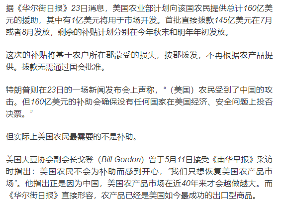

# Baidu OCR api tool

## Preparation
&nbsp;You need to apply one Baidu Developer account and finish verification: 

https://login.bce.baidu.com/reg.html?tpl=bceplat&from=portal

&nbsp;Create an OCR application:

http://ai.baidu.com/tech/ocr/general

&nbsp;Official documentation:

http://ai.baidu.com/docs#/OCR-API/4ab3ea9e

## Usage

```go
package main

import (
	"log"
	"ocr/ocr"
)

/*   Set you API key and secret Key in token/token.go   */

func main(){
    res, err := ocr.OCR("b.png")
    if err != nil {
	    panic(err)
    }
    
    for _, v := range res{
        for k1, v1 := range v {
            if k1 == "words" {
                log.Printf("%s"+"\r\n", v1)
            }
        }
    }
}
	
```
`sample png`



```
《----OCR Results----》
据《华尔街日报》23日消息,美国农业部计划向该国农民提供总计160亿美
元的援助,其中有1亿美元将用于市场开发首批直接拨款145亿美元在7月
或者8月发放,剩余的补贴计划分别在今年秋末和明年年初发放。
这次的补贴将基于农户所在郡蒙受的损失,按郡拨发,不再根据农产品提
供。拨款无需通过国会批准。
特朗普则在23日的一场新闻发布会上声称,“美国)农民受到了中国的攻
击。但160亿美元的补助会确保没有任何国家在美国经济、安全问题上投否
决票。”
但实际上美国农民最需要的不是补助。
美国大豆协会副会长戈登(《(Biordon5《)曾于5月11日接受《南华早报》采访
时指出:美国农民不会为补助而感到开心,“我们只想恢复美国农产品市
场”。他指出正是因为中国,美国农产品市场在近40年来才会越做越大。而
《华尔街日报》直接形容,农产品已经是美国如今最成功的出口型商品。

《----置信度(Probability)----》
0.999018
0.999547
0.999068
0.997927
0.992872
0.995622
0.997788
0.981049
0.999370
0.996308
0.997685
0.995415
0.996018
```
